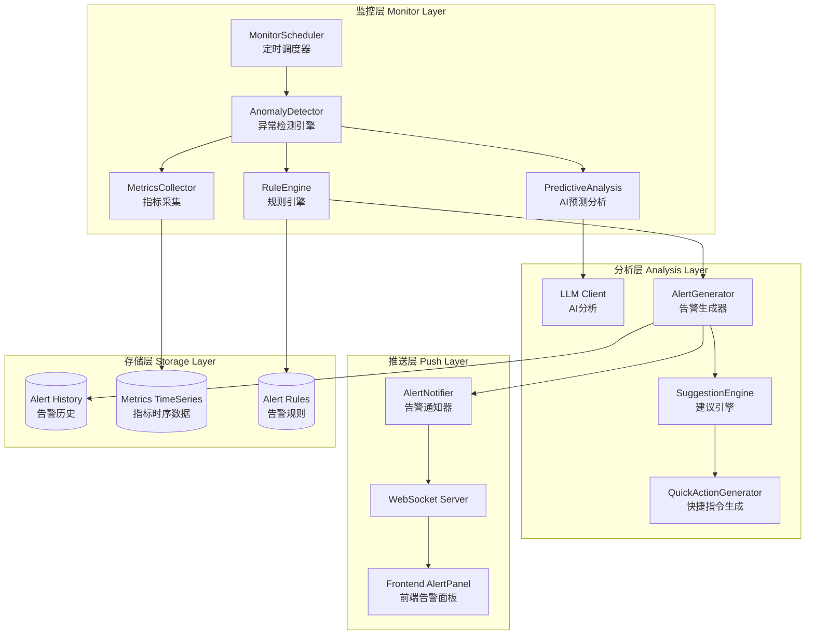

# AI-Ops 预测性维护与主动监控告警系统

## 架构设计文档

### 1. 系统概述

本系统实现了基于 AI 的预测性维护和主动监控告警功能，通过 WebSocket 实时推送异常告警到前端对话框，并根据主机状态动态生成快捷指令建议。

### 2. 核心架构



### 3. 核心组件设计

#### 3.1 异常检测器 (AnomalyDetector)

**文件**: `C:\Users\hrp\Downloads\ai-pro\internal\monitor\detector.go`

**职责**:
- 采集主机性能指标 (CPU, Memory, Disk, IO)
- 基于规则的异常检测
- AI 驱动的预测性分析
- 趋势检测和异常预警

**关键方法**:
```go
// 检测异常
func (d *AnomalyDetector) DetectAnomalies(ctx context.Context, hosts []string) ([]*Alert, error)

// 采集指标
func (d *AnomalyDetector) collectMetrics(hostName string) (*HostMetrics, error)

// 规则检测
func (d *AnomalyDetector) checkRules(metrics *HostMetrics) []*Alert

// AI 预测性分析
func (d *AnomalyDetector) predictiveAnalysis(ctx context.Context, hostName string, current *HostMetrics) []*Alert
```

**检测策略**:
1. **规则检测**: 基于阈值的实时告警
   - CPU 使用率 > 80%
   - 内存使用率 > 85%
   - 磁盘使用率 > 90%

2. **趋势检测**: 基于历史数据的趋势分析
   - 持续上升趋势检测
   - 异常波动检测
   - 周期性模式识别

3. **AI 预测**: 基于 LLM 的智能分析
   - 性能瓶颈预测
   - 故障风险评估
   - 优化建议生成

#### 3.2 告警通知器 (AlertNotifier)

**文件**: `C:\Users\hrp\Downloads\ai-pro\internal\monitor\notifier.go`

**职责**:
- 管理 WebSocket 客户端连接
- 广播告警消息到所有客户端
- 推送实时指标数据

**关键方法**:
```go
// 注册客户端
func (n *AlertNotifier) RegisterClient(clientID string, conn *websocket.Conn)

// 推送告警
func (n *AlertNotifier) Notify(alert *Alert) error

// 广播指标
func (n *AlertNotifier) BroadcastMetrics(metrics *HostMetrics) error
```

#### 3.3 监控调度器 (MonitorScheduler)

**文件**: `C:\Users\hrp\Downloads\ai-pro\internal\monitor\scheduler.go`

**职责**:
- 定时触发监控检查
- 管理监控主机列表
- 协调检测和通知流程

**配置参数**:
```go
interval := 30 * time.Second  // 检查间隔
hosts := []string{"web-01", "db-01", "cache-01"}  // 监控主机
```

#### 3.4 告警模型 (Alert)

**文件**: `C:\Users\hrp\Downloads\ai-pro\internal\monitor\alert.go`

**数据结构**:
```go
type Alert struct {
    ID          string                 // 告警ID
    HostName    string                 // 主机名
    Type        AlertType              // 告警类型
    Level       AlertLevel             // 告警级别
    Title       string                 // 告警标题
    Message     string                 // 告警消息
    Metrics     map[string]interface{} // 相关指标
    Suggestions []string               // 处理建议
    Actions     []QuickAction          // 快捷操作
    CreatedAt   time.Time              // 创建时间
    Status      string                 // 状态
}

type QuickAction struct {
    ID          string  // 操作ID
    Label       string  // 显示标签
    Command     string  // 执行命令
    Description string  // 描述
    Dangerous   bool    // 是否危险操作
}
```

**告警级别**:
- `critical`: 严重告警，需立即处理
- `high`: 高级告警，1小时内处理
- `medium`: 中级告警，当天处理
- `low`: 低级告警，计划处理

**告警类型**:
- `cpu`: CPU 使用率告警
- `memory`: 内存使用率告警
- `disk`: 磁盘使用率告警
- `network`: 网络异常告警
- `process`: 进程异常告警
- `service`: 服务状态告警
- `predictive`: 预测性告警

### 4. 前端集成

#### 4.1 WebSocket 集成

**文件**: `C:\Users\hrp\Downloads\ai-pro\web\src\composables\useMonitorAlerts.ts`

**功能**:
- 建立 WebSocket 连接
- 接收实时告警消息
- 管理告警状态
- 触发通知显示

**使用示例**:
```typescript
import { useMonitorAlerts } from '@/composables/useMonitorAlerts'

const {
  alerts,              // 告警列表
  latestMetrics,       // 最新指标
  isConnected,         // 连接状态
  resolveAlert,        // 解决告警
  ignoreAlert,         // 忽略告警
  getActiveAlerts      // 获取活跃告警
} = useMonitorAlerts()
```

#### 4.2 告警面板组件

**文件**: `C:\Users\hrp\Downloads\ai-pro\web\src\components\monitor\AlertPanel.vue`

**功能**:
- 显示实时告警列表
- 展示告警详情和指标
- 提供快捷操作按钮
- 告警状态管理

**特性**:
- 按告警级别分类显示
- 实时更新告警状态
- 一键执行快捷指令
- 告警历史记录

### 5. API 接口设计

#### 5.1 WebSocket 连接

```
GET /api/monitor/ws
```

**消息格式**:
```json
{
  "type": "alert",
  "data": {
    "id": "alert-1234567890",
    "host_name": "web-01",
    "type": "cpu",
    "level": "high",
    "title": "CPU 使用率过高",
    "message": "主机 web-01 CPU 使用率 85.3% 超过阈值 80%",
    "metrics": {
      "cpu": 85.3,
      "memory": 72.1,
      "disk": 45.2
    },
    "suggestions": [
      "检查 CPU 占用最高的进程",
      "分析是否有死循环或异常计算",
      "考虑增加 CPU 资源或优化代码"
    ],
    "actions": [
      {
        "id": "top",
        "label": "查看进程",
        "command": "top -bn1 | head -20"
      },
      {
        "id": "cpu-top",
        "label": "CPU Top 10",
        "command": "ps aux --sort=-%cpu | head -11"
      }
    ],
    "created_at": "2026-01-03T10:30:00Z",
    "status": "active"
  }
}
```

#### 5.2 添加告警规则

```
POST /api/monitor/rules
```

**请求体**:
```json
{
  "name": "CPU 高使用率告警",
  "type": "cpu",
  "level": "high",
  "condition": {
    "threshold": 80.0,
    "duration": 300
  },
  "enabled": true,
  "hosts": ["web-01", "web-02"]
}
```

#### 5.3 更新监控主机

```
POST /api/monitor/hosts
```

**请求体**:
```json
{
  "hosts": ["web-01", "web-02", "db-01", "cache-01"]
}
```

#### 5.4 手动触发检查

```
POST /api/monitor/check
```

**请求体**:
```json
{
  "hosts": ["web-01"]
}
```

**响应**:
```json
{
  "code": 0,
  "data": {
    "alerts": [...],
    "count": 2,
    "time": "2026-01-03T10:30:00Z"
  }
}
```

### 6. 部署配置

#### 6.1 初始化监控系统

在 `C:\Users\hrp\Downloads\ai-pro\cmd\server\main.go` 中添加:

```go
import (
    "ai-ops/internal/monitor"
    "time"
)

// 初始化监控组件
logger := logger.GetLogger()
notifier := monitor.NewAlertNotifier(logger)
detector := monitor.NewAnomalyDetector(sshPool, llmClient)
scheduler := monitor.NewMonitorScheduler(detector, notifier, 30*time.Second, logger)

// 添加默认告警规则
detector.AddRule(&monitor.AlertRule{
    ID:      "cpu-high",
    Name:    "CPU 使用率告警",
    Type:    monitor.AlertTypeCPU,
    Level:   monitor.AlertLevelHigh,
    Condition: map[string]interface{}{
        "threshold": 80.0,
    },
    Enabled: true,
})

detector.AddRule(&monitor.AlertRule{
    ID:      "memory-high",
    Name:    "内存使用率告警",
    Type:    monitor.AlertTypeMemory,
    Level:   monitor.AlertLevelHigh,
    Condition: map[string]interface{}{
        "threshold": 85.0,
    },
    Enabled: true,
})

// 设置监控主机
hosts, _ := hostRepo.List(repository.HostFilter{})
hostNames := make([]string, len(hosts))
for i, h := range hosts {
    hostNames[i] = h.Name
}
scheduler.SetHosts(hostNames)

// 启动监控调度器
go scheduler.Start()

// 传递给��由
router := api.NewRouter(api.RouterConfig{
    // ... 其他配置
    MonitorDetector:  detector,
    MonitorNotifier:  notifier,
    MonitorScheduler: scheduler,
})
```

#### 6.2 配置文件

在 `config.yaml` 中添加:

```yaml
monitor:
  enabled: true
  interval: 30s  # 检查间隔
  rules:
    - name: "CPU 高使用率"
      type: cpu
      threshold: 80
      level: high
    - name: "内存高使用率"
      type: memory
      threshold: 85
      level: high
    - name: "磁盘空间不足"
      type: disk
      threshold: 90
      level: critical
```

### 7. 快捷指令生成策略

系统根据告警类型自动生成相关的快捷操作指令:

#### CPU 告警
```go
[]QuickAction{
    {ID: "top", Label: "查看进程", Command: "top -bn1 | head -20"},
    {ID: "cpu-top", Label: "CPU Top 10", Command: "ps aux --sort=-%cpu | head -11"},
}
```

#### 内存告警
```go
[]QuickAction{
    {ID: "free", Label: "内存状态", Command: "free -h"},
    {ID: "mem-top", Label: "内存 Top 10", Command: "ps aux --sort=-%mem | head -11"},
}
```

#### 磁盘告警
```go
[]QuickAction{
    {ID: "df", Label: "磁盘使用", Command: "df -h"},
    {ID: "du", Label: "目录占用", Command: "du -sh /* 2>/dev/null | sort -hr | head -10"},
}
```

### 8. 性能优化建议

#### 8.1 指标采集优化
- 使用并发采集减少延迟
- 实现指标缓存避免重复查询
- 批量采集多个主机指标

#### 8.2 WebSocket 优化
- 实现消息队列避免阻塞
- 支持消息压缩减少带宽
- 实现心跳机制保持连接

#### 8.3 存储优化
- 使用时序数据库存储指标 (InfluxDB, Prometheus)
- 实现数据降采样和归档
- 定期清理过期告警

### 9. 扩展性设计

#### 9.1 自定义告警规则
支持用户自定义复杂告警规则:
```go
type AlertRule struct {
    Condition map[string]interface{}{
        "threshold": 80.0,
        "duration": 300,      // 持续时间
        "comparison": "gt",   // 比较运算符
        "aggregation": "avg", // 聚合方式
    }
}
```

#### 9.2 多渠道通知
扩展通知渠道:
- WebSocket (已实现)
- Email
- Slack/钉钉/企业微信
- SMS
- Webhook

#### 9.3 AI 增强
- 异常模式学习
- 自动调整阈值
- 根因分析
- 智能降噪

### 10. 监控指标

系统成功指标:
- 告警准确率 > 95%
- 误报率 < 5%
- 平均检测延迟 < 30s
- WebSocket 连接稳定性 > 99%
- 系统资源占用 < 5%

### 11. 文件清单

**后端核心文件**:
- `C:\Users\hrp\Downloads\ai-pro\internal\monitor\alert.go` - 告警模型定义
- `C:\Users\hrp\Downloads\ai-pro\internal\monitor\detector.go` - 异常检测引擎
- `C:\Users\hrp\Downloads\ai-pro\internal\monitor\notifier.go` - 告警通知器
- `C:\Users\hrp\Downloads\ai-pro\internal\monitor\scheduler.go` - 监控调度器
- `C:\Users\hrp\Downloads\ai-pro\internal\api\handler\monitor.go` - HTTP 处理器

**前端核心文件**:
- `C:\Users\hrp\Downloads\ai-pro\web\src\composables\useMonitorAlerts.ts` - WebSocket 集成
- `C:\Users\hrp\Downloads\ai-pro\web\src\components\monitor\AlertPanel.vue` - 告警面板组件

**配置文件**:
- `C:\Users\hrp\Downloads\ai-pro\internal\api\router.go` - 路由配置 (已更新)

### 12. 下一步实施

1. **集成到主程序**: 在 `main.go` 中初始化监控组件
2. **前端集成**: 在主界面添加 AlertPanel 组件
3. **数据库迁移**: 添加告警历史表
4. **测试验证**: 编写单元测试和集成测试
5. **文档完善**: 添加用户使用文档

---

## 架构决策记录 (ADR)

### ADR-001: 选择 WebSocket 作为实时推送协议

**状态**: Accepted

**背景**: 需要实时推送告警到前端，考虑了 HTTP 轮询、Server-Sent Events (SSE) 和 WebSocket。

**决策**: 选择 WebSocket

**理由**:
- 双向通信能力，支持客户端主动操作
- 低延迟，适合实时告警场景
- 连接复用，减少服务器负载
- 成熟的生态系统和库支持

**后果**:
- 需要处理连接管理和重连逻辑
- 需要实现心跳机制保持连接
- 增加了系统复杂度

### ADR-002: 采用规则引擎 + AI 预测的混合检测策略

**状态**: Accepted

**背景**: 需要平衡检测准确性和系统性能。

**决策**: 规则引擎处理实时告警，AI 预测处理趋势分析

**理由**:
- 规则引擎响应快，适合实时告警
- AI 预测准确度高，适合复杂场景
- 混合策略兼顾性能和准确性

**后果**:
- 需要维护两套检测逻辑
- AI 调用有成本和延迟
- 需要平衡两种策略的权重
