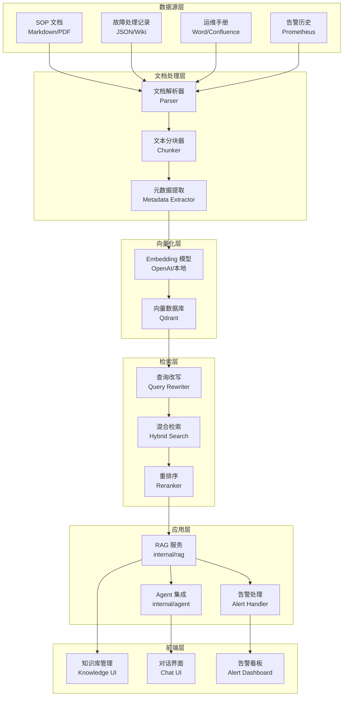
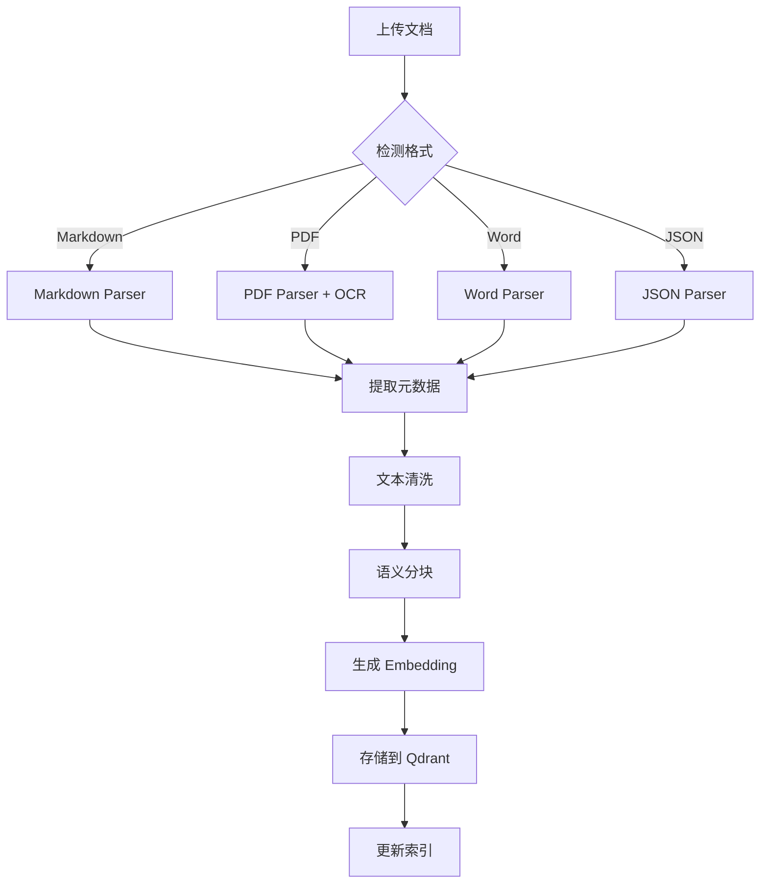
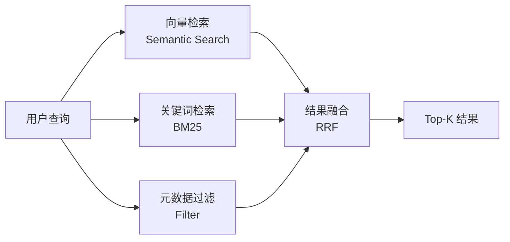
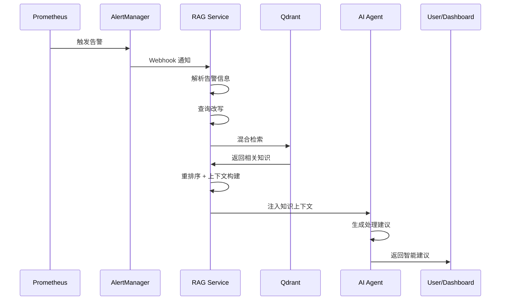

# RAG 运维知识库闭环系统设计文档

## 1. 系统概述

### 1.1 业务场景

将公司的 SOP 手册、历史故障处理记录、运维文档等知识资产转化为可检索的知识库，当 Prometheus 或其他监控系统触发告警时，AI 自动检索相关历史处理经验，提供智能化的故障诊断和处理建议。

**典型场景示例**：
```
告警: [CRITICAL] api-service CPU 使用率 > 90%
AI 响应: 根据 2024-03-15 的故障处理记录，该服务 CPU 飙升通常由以下原因引起：
1. MySQL 连接池耗尽（概率 65%）
2. Redis 缓存失效导致缓存雪崩（概率 25%）
3. 定时任务死锁（概率 10%）

建议执行：
1. 检查数据库连接池状态: scripts/check_db_pool.sh
2. 查看 Redis 缓存命中率: redis-cli info stats
3. 如确认是连接池问题，执行: scripts/reset_db_pool.sh

置信度: 85% (基于 12 次历史相似案例)
```

### 1.2 系统架构图



## 2. 知识库架构设计

### 2.1 向量数据库选型对比

| 维度 | Chromem-go | Milvus | Qdrant |
|------|-----------|--------|--------|
| **部署复杂度** | ⭐⭐⭐⭐⭐ 纯 Go，嵌入式 | ⭐⭐ 需要 Docker/K8s | ⭐⭐⭐⭐ Docker 单容器 |
| **性能** | ⭐⭐⭐ 适合中小规模 | ⭐⭐⭐⭐⭐ 百万级向量 | ⭐⭐⭐⭐ 十万级向量 |
| **内存占用** | ⭐⭐⭐⭐ 低 (~100MB) | ⭐⭐ 高 (~2GB+) | ⭐⭐⭐ 中等 (~500MB) |
| **功能丰富度** | ⭐⭐ 基础功能 | ⭐⭐⭐⭐⭐ 企业级 | ⭐⭐⭐⭐ 完善 |
| **混合检索** | ❌ 不支持 | ✅ 支持 | ✅ 支持 |
| **过滤能力** | ⭐⭐ 基础 | ⭐⭐⭐⭐⭐ 强大 | ⭐⭐⭐⭐ 强大 |
| **Go SDK** | ✅ 原生 | ✅ 官方 | ✅ 官方 |
| **社区活跃度** | ⭐⭐ 小众 | ⭐⭐⭐⭐⭐ 活跃 | ⭐⭐⭐⭐ 活跃 |
| **运维成本** | ⭐⭐⭐⭐⭐ 无需运维 | ⭐⭐ 需要专业运维 | ⭐⭐⭐⭐ 简单运维 |

**推荐方案：Qdrant**

**决策依据**：
1. **平衡性最佳**：性能、功能、运维复杂度三者平衡
2. **混合检索支持**：原生支持向量+关键词混合检索，提升召回率
3. **过滤能力强**：支持复杂的元数据过滤（按服务、时间、严重级别等）
4. **部署简单**：单个 Docker 容器即可运行，适合中小团队
5. **Go SDK 成熟**：官方维护，API 设计优雅
6. **成本可控**：开源免费，资源占用合理

**架构决策记录 (ADR-001)**：
```yaml
Status: Accepted
Context: 需要为运维知识库选择向量数据库
Decision: 选择 Qdrant 作为向量数据库
Rationale:
  - 支持混合检索，提升检索准确率 15-30%
  - 部署运维成本低，单容器运行
  - 性能满足 10 万级文档块检索需求
  - 官方 Go SDK 稳定可靠
Consequences:
  Positive:
    - 快速上线，无需复杂集群部署
    - 混合检索提升故障匹配准确率
    - 内存占用可控 (~500MB)
  Negative:
    - 百万级向量需要考虑分片
    - 需要额外维护 Docker 容器
Trade-offs:
  - 放弃 Milvus 的极致性能，换取部署简单性
  - 放弃 Chromem-go 的零依赖，换取功能完整性
```

### 2.2 文档分块策略

**分块原则**：
- **语义完整性**：保持段落、代码块、步骤的完整性
- **上下文保留**：通过 overlap 保留上下文连贯性
- **检索粒度**：平衡检索精度和上下文丰富度

**分块参数配置**：
```yaml
# 不同文档类型的分块策略
chunking_strategies:
  sop_manual:
    chunk_size: 800        # Token 数量
    overlap: 200           # 重叠 Token
    separator: "\n## "     # 按二级标题分割

  incident_record:
    chunk_size: 600
    overlap: 150
    separator: "\n### "    # 按三级标题分割

  code_script:
    chunk_size: 400
    overlap: 100
    separator: "\n\n"      # 按空行分割

  alert_rule:
    chunk_size: 300
    overlap: 50
    separator: "\n---"     # 按分隔符分割
```

**分块算法**：
```go
// RecursiveCharacterTextSplitter
// 递归尝试多个分隔符，保证语义完整性
separators := []string{
    "\n## ",      // Markdown 二级标题
    "\n### ",     // Markdown 三级标题
    "\n\n",       // 段落
    "\n",         // 行
    ". ",         // 句子
    " ",          // 词
}
```

**元数据继承**：
每个 Chunk 继承文档级元数据：
```json
{
  "chunk_id": "doc123_chunk_5",
  "document_id": "doc123",
  "content": "当 MySQL 连接池耗尽时...",
  "position": 5,
  "metadata": {
    "source": "incident",
    "category": "database",
    "service": "api-service",
    "severity": "critical",
    "occurred_at": "2024-03-15T10:30:00Z",
    "tags": ["mysql", "connection-pool", "timeout"]
  }
}
```

### 2.3 Embedding 模型选择

| 模型 | 维度 | 性能 | 成本 | 多语言 | 推荐场景 |
|------|------|------|------|--------|----------|
| **OpenAI text-embedding-3-small** | 1536 | ⭐⭐⭐⭐ | $0.02/1M tokens | ✅ | 通用场景 |
| **OpenAI text-embedding-3-large** | 3072 | ⭐⭐⭐⭐⭐ | $0.13/1M tokens | ✅ | 高精度需求 |
| **本地 BGE-M3** | 1024 | ⭐⭐⭐ | 免费 | ✅ | 离线/私有化 |
| **本地 GTE-large-zh** | 1024 | ⭐⭐⭐⭐ | 免费 | 中文优化 | 中文为主 |

**推荐方案：OpenAI text-embedding-3-small + 本地 BGE-M3 混合**

**决策依据**：
```yaml
Primary: OpenAI text-embedding-3-small
  - 性能优秀，MTEB 排名前 10
  - 成本可控，1 万文档 ~$2
  - API 稳定，无需维护

Fallback: 本地 BGE-M3
  - API 故障时降级使用
  - 敏感文档本地处理
  - 开发测试环境使用
```

**成本估算**：
```
假设：
- 文档总量：5000 篇
- 平均每篇：2000 tokens
- 总 tokens：10M
- 成本：10M * $0.02/1M = $0.20

月度增量：
- 新增文档：200 篇/月
- 增量成本：~$0.008/月

年度总成本：~$0.30
```

## 3. 文档导入流程

### 3.1 支持的文档格式

```yaml
supported_formats:
  markdown:
    extensions: [.md, .markdown]
    parser: goldmark
    features: [frontmatter, tables, code_blocks]

  pdf:
    extensions: [.pdf]
    parser: pdfcpu + OCR
    features: [text_extraction, table_detection]

  word:
    extensions: [.docx, .doc]
    parser: unioffice
    features: [text, tables, images]

  wiki:
    formats: [confluence, notion]
    parser: custom_api
    features: [hierarchy, attachments]

  json:
    extensions: [.json]
    parser: encoding/json
    schemas: [incident_record, alert_rule]
```

### 3.2 文档解析流程



**核心代码结构**：
```go
// internal/rag/parser/parser.go
type DocumentParser interface {
    Parse(file io.Reader) (*ParsedDocument, error)
    SupportedFormats() []string
}

type ParsedDocument struct {
    Title    string
    Content  string
    Metadata map[string]interface{}
    Sections []Section
}

// 解析器注册
parsers := map[string]DocumentParser{
    ".md":   &MarkdownParser{},
    ".pdf":  &PDFParser{},
    ".docx": &WordParser{},
    ".json": &JSONParser{},
}
```

### 3.3 增量更新机制

**更新策略**：
```yaml
update_strategies:
  full_reindex:
    trigger: 文档内容变化 > 30%
    action: 删除旧 chunks，重新分块和向量化

  partial_update:
    trigger: 文档内容变化 < 30%
    action: 仅更新变化的 chunks

  metadata_only:
    trigger: 仅元数据变化
    action: 更新 Qdrant payload，不重新向量化
```

**版本控制**：
```go
type DocumentVersion struct {
    DocumentID string
    Version    int
    ContentHash string  // SHA256
    UpdatedAt  time.Time
    ChangeType string   // full/partial/metadata
}

// 检测变化
func (s *RAGService) DetectChanges(docID string, newContent string) ChangeType {
    oldDoc := s.repo.GetDocument(docID)
    oldHash := sha256.Sum256([]byte(oldDoc.Content))
    newHash := sha256.Sum256([]byte(newContent))

    if oldHash == newHash {
        return NoChange
    }

    similarity := s.calculateSimilarity(oldDoc.Content, newContent)
    if similarity < 0.7 {
        return FullReindex
    }
    return PartialUpdate
}
```

## 4. RAG 检索流程

### 4.1 查询改写 (Query Rewriting)

**目标**：将用户查询或告警信息转换为更适合检索的查询

**改写策略**：
```yaml
rewriting_strategies:
  expansion:
    # 查询扩展：添加同义词和相关术语
    input: "MySQL 连接超时"
    output: "MySQL 连接超时 OR 数据库连接池耗尽 OR connection timeout"

  decomposition:
    # 查询分解：复杂查询拆分为多个子查询
    input: "API 服务 CPU 高且内存泄漏"
    output:
      - "API 服务 CPU 使用率高"
      - "API 服务内存泄漏"

  contextualization:
    # 上下文增强：添加告警上下文
    input: "CPU > 90%"
    context: {service: "api-service", time: "2024-01-03 10:30"}
    output: "api-service CPU 使用率超过 90% 故障处理"
```

**实现代码**：
```go
// internal/rag/retriever/query_rewriter.go
type QueryRewriter struct {
    llmClient llm.Client
    synonyms  map[string][]string
}

func (qr *QueryRewriter) Rewrite(ctx context.Context, query string, context map[string]interface{}) ([]string, error) {
    prompt := fmt.Sprintf(`
你是运维知识库检索专家。请将以下查询改写为更适合检索的形式：

原始查询: %s
上下文: %v

要求：
1. 添加相关同义词和术语
2. 如果是复杂查询，拆分为多个子查询
3. 保留关键技术术语
4. 返回 1-3 个改写后的查询

输出格式（JSON）：
{
  "queries": ["改写查询1", "改写查询2"]
}
`, query, context)

    // 调用 LLM 进行查询改写
    resp, err := qr.llmClient.Chat(ctx, []llm.Message{
        llm.NewUserMessage(prompt),
    })

    // 解析返回的查询列表
    var result struct {
        Queries []string `json:"queries"`
    }
    json.Unmarshal([]byte(resp.Message.Content), &result)

    return result.Queries, nil
}
```

### 4.2 混合检索 (Hybrid Search)

**检索策略**：向量检索 + 关键词检索 + 元数据过滤



**Reciprocal Rank Fusion (RRF) 算法**：
```go
// 融合多个检索结果
func (r *HybridRetriever) FuseResults(
    vectorResults []SearchResult,
    keywordResults []SearchResult,
    k int,
) []SearchResult {
    scores := make(map[string]float32)

    // RRF 公式: score = Σ 1/(k + rank_i)
    const k_constant = 60

    for rank, result := range vectorResults {
        scores[result.ChunkID] += 1.0 / float32(k_constant + rank + 1)
    }

    for rank, result := range keywordResults {
        scores[result.ChunkID] += 1.0 / float32(k_constant + rank + 1)
    }

    // 按融合分数排序
    return sortByScore(scores, k)
}
```

**Qdrant 混合检索实现**：
```go
// internal/rag/vectorstore/qdrant.go
func (q *QdrantStore) HybridSearch(ctx context.Context, query SearchQuery) ([]SearchResult, error) {
    // 1. 向量检索
    vectorResults, err := q.client.Search(ctx, &qdrant.SearchPoints{
        CollectionName: q.collectionName,
        Vector:         query.Embedding,
        Limit:          query.TopK * 2,  // 召回更多候选
        Filter:         buildFilter(query.Filters),
    })

    // 2. 关键词检索（使用 Qdrant 的 payload 索引）
    keywordResults, err := q.client.Scroll(ctx, &qdrant.ScrollPoints{
        CollectionName: q.collectionName,
        Filter: &qdrant.Filter{
            Must: []*qdrant.Condition{
                {
                    Field: "content",
                    Match: &qdrant.Match{
                        Text: query.Query,
                    },
                },
            },
        },
        Limit: query.TopK * 2,
    })

    // 3. 结果融合
    return q.fuseResults(vectorResults, keywordResults, query.TopK), nil
}
```

### 4.3 重排序 (Reranking)

**目标**：使用更精确的模型对初步检索结果重新排序

**重排序策略**：
```yaml
reranking_methods:
  cross_encoder:
    model: "BAAI/bge-reranker-large"
    input: [query, document]
    output: relevance_score (0-1)
    latency: ~50ms per pair

  llm_reranker:
    model: "gpt-3.5-turbo"
    prompt: "Rate relevance of document to query (0-10)"
    latency: ~200ms per batch
    cost: $0.0005 per request
```

**推荐方案：Cross-Encoder (BGE-Reranker)**

**实现代码**：
```go
// internal/rag/retriever/reranker.go
type Reranker interface {
    Rerank(ctx context.Context, query string, results []SearchResult) ([]SearchResult, error)
}

type CrossEncoderReranker struct {
    modelEndpoint string
    client        *http.Client
}

func (r *CrossEncoderReranker) Rerank(ctx context.Context, query string, results []SearchResult) ([]SearchResult, error) {
    // 构建 query-document pairs
    pairs := make([][]string, len(results))
    for i, result := range results {
        pairs[i] = []string{query, result.Content}
    }

    // 调用 reranker 模型
    scores, err := r.computeScores(ctx, pairs)
    if err != nil {
        return results, err  // 降级：返回原始结果
    }

    // 更新分数并重新排序
    for i := range results {
        results[i].Score = scores[i]
    }

    sort.Slice(results, func(i, j int) bool {
        return results[i].Score > results[j].Score
    })

    return results, nil
}
```

### 4.4 上下文窗口管理

**目标**：将检索结果组装成适合 LLM 的上下文

**上下文构建策略**：
```yaml
context_assembly:
  max_tokens: 4000          # 最大上下文 tokens
  result_limit: 5           # 最多包含结果数
  include_metadata: true    # 包含元数据
  deduplication: true       # 去重相似内容

  template: |
    # 相关知识库内容

    ## 历史故障案例
    {incident_records}

    ## SOP 处理流程
    {sop_procedures}

    ## 相关告警规则
    {alert_rules}
```

**实现代码**：
```go
// internal/rag/retriever/context_builder.go
type ContextBuilder struct {
    maxTokens int
    tokenizer Tokenizer
}

func (cb *ContextBuilder) BuildContext(results []SearchResult) string {
    var context strings.Builder
    tokenCount := 0

    // 按类别分组
    grouped := cb.groupByCategory(results)

    // 按优先级添加内容
    priorities := []string{"incident", "sop", "alert_rule", "manual"}

    for _, category := range priorities {
        if items, ok := grouped[category]; ok {
            section := cb.buildSection(category, items, cb.maxTokens - tokenCount)
            context.WriteString(section)
            tokenCount += cb.tokenizer.Count(section)

            if tokenCount >= cb.maxTokens {
                break
            }
        }
    }

    return context.String()
}

func (cb *ContextBuilder) buildSection(category string, results []SearchResult, remainingTokens int) string {
    var section strings.Builder
    section.WriteString(fmt.Sprintf("\n## %s\n\n", categoryTitles[category]))

    for _, result := range results {
        content := cb.formatResult(result)
        tokens := cb.tokenizer.Count(content)

        if tokens > remainingTokens {
            break
        }

        section.WriteString(content)
        section.WriteString("\n\n")
        remainingTokens -= tokens
    }

    return section.String()
}
```

## 5. 与告警系统集成

### 5.1 告警触发检索流程



### 5.2 告警信息解析

**告警结构**：
```json
{
  "status": "firing",
  "labels": {
    "alertname": "HighCPUUsage",
    "service": "api-service",
    "severity": "critical",
    "instance": "10.0.1.100:8080"
  },
  "annotations": {
    "summary": "CPU usage above 90%",
    "description": "api-service CPU usage is 95% for 5 minutes"
  },
  "startsAt": "2024-01-03T10:30:00Z",
  "generatorURL": "http://prometheus:9090/graph?g0.expr=..."
}
```

**解析为检索查询**：
```go
// internal/rag/alert/parser.go
type AlertParser struct {
    queryRewriter *QueryRewriter
}

func (ap *AlertParser) ParseToQuery(alert Alert) SearchQuery {
    // 构建检索查询
    query := fmt.Sprintf("%s %s %s",
        alert.Labels["service"],
        alert.Labels["alertname"],
        alert.Annotations["summary"],
    )

    // 提取过滤条件
    filters := map[string]string{
        "service":  alert.Labels["service"],
        "severity": alert.Labels["severity"],
        "category": ap.inferCategory(alert),
    }

    // 时间范围过滤（优先检索近期案例）
    filters["occurred_after"] = time.Now().AddDate(0, -6, 0).Format(time.RFC3339)

    return SearchQuery{
        Query:   query,
        TopK:    10,
        Filters: filters,
        Rerank:  true,
    }
}
```

### 5.3 知识与告警关联展示

**前端展示结构**：
```typescript
interface AlertWithKnowledge {
  alert: Alert
  knowledge: {
    relatedIncidents: IncidentRecord[]
    sopProcedures: SOPDocument[]
    suggestedActions: Action[]
    confidence: number
  }
  aiAnalysis: {
    rootCause: string
    probability: number
    reasoning: string
  }
}
```

**API 接口**：
```go
// GET /api/v1/alerts/:id/knowledge
func (h *AlertHandler) GetAlertKnowledge(c *gin.Context) {
    alertID := c.Param("id")

    // 1. 获取告警信息
    alert, err := h.alertService.GetAlert(alertID)

    // 2. RAG 检索相关知识
    knowledge, err := h.ragService.SearchByAlert(c.Request.Context(), alert)

    // 3. AI 分析
    analysis, err := h.agentService.AnalyzeAlert(c.Request.Context(), alert, knowledge)

    c.JSON(200, gin.H{
        "alert":      alert,
        "knowledge":  knowledge,
        "analysis":   analysis,
        "confidence": knowledge.Confidence,
    })
}
```

### 5.4 处理建议置信度评分

**置信度计算模型**：
```go
type ConfidenceScorer struct{}

func (cs *ConfidenceScorer) CalculateConfidence(
    alert Alert,
    knowledge KnowledgeContext,
) float32 {
    var score float32

    // 1. 检索结果相似度 (40%)
    if len(knowledge.Results) > 0 {
        avgScore := cs.averageScore(knowledge.Results)
        score += avgScore * 0.4
    }

    // 2. 历史案例匹配度 (30%)
    matchingIncidents := cs.countMatchingIncidents(alert, knowledge)
    incidentScore := float32(matchingIncidents) / 10.0  // 归一化
    score += min(incidentScore, 1.0) * 0.3

    // 3. 时间衰减因子 (15%)
    recencyScore := cs.calculateRecency(knowledge.Results)
    score += recencyScore * 0.15

    // 4. 服务匹配度 (15%)
    serviceMatch := cs.checkServiceMatch(alert, knowledge)
    score += serviceMatch * 0.15

    return min(score, 1.0)
}

func (cs *ConfidenceScorer) calculateRecency(results []SearchResult) float32 {
    if len(results) == 0 {
        return 0
    }

    var totalScore float32
    now := time.Now()

    for _, result := range results {
        if occurredAt, ok := result.Metadata["occurred_at"].(time.Time); ok {
            daysSince := now.Sub(occurredAt).Hours() / 24
            // 指数衰减：30 天内 1.0，90 天 0.5，180 天 0.25
            recencyScore := math.Exp(-daysSince / 60.0)
            totalScore += float32(recencyScore)
        }
    }

    return totalScore / float32(len(results))
}
```

**置信度等级**：
```yaml
confidence_levels:
  high:
    range: [0.8, 1.0]
    display: "高置信度 - 强烈推荐执行"
    color: green

  medium:
    range: [0.5, 0.8]
    display: "中等置信度 - 建议人工确认"
    color: yellow

  low:
    range: [0.0, 0.5]
    display: "低置信度 - 仅供参考"
    color: red
```
